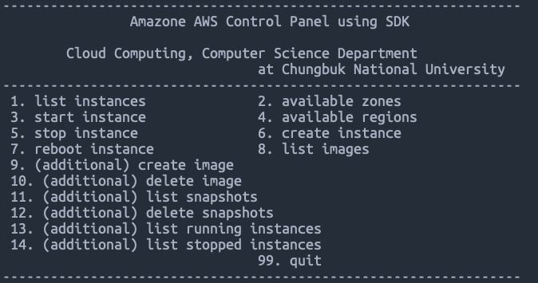

## 2019-03 Cloud Computing Project

2019학년도 2학기 클라우드컴퓨팅 텀프로젝트

### Subject

Controlling AWS ec2 instances with AWS SDK

### Menu

1. list instance
2. list available zones
3. start instance
4. list available regions
5. stop instance
6. create instance
7. reboot instance
8. list images (AMI)

### Additional Functions

9. create image (AMI) from instance
10. delete image (AMI)
11. list snapshots
12. delete snapshots
13. list running instance
14. list stopped instance

### Requirements

1. Python3 (tested on 3.7.3)
2. aws access key on ~/.aws/credentials

### How to run

```
pip3 install -r requirements.txt
python3 run.py
```

> easy !

### Image

